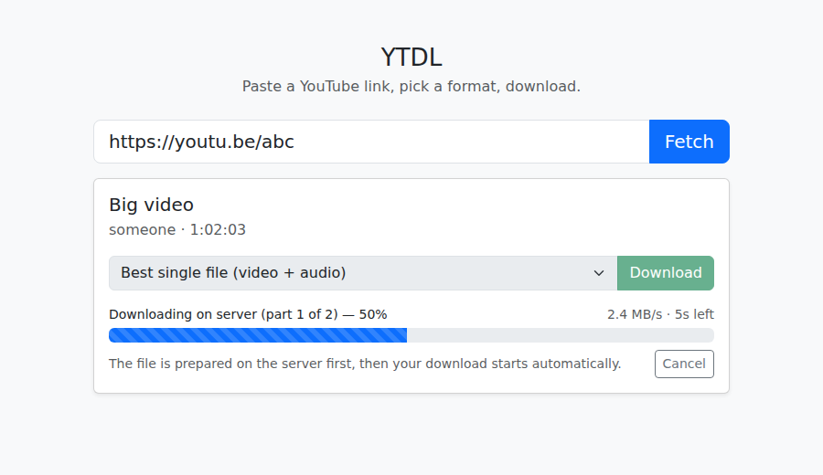

# ytdl-site

A minimal YouTube downloader: a zero-dependency Node server that shells out to [yt-dlp](https://github.com/yt-dlp/yt-dlp), and a single page styled with plain Bootstrap 5 (no custom CSS).



## Requirements

- Node 18+
- [yt-dlp](https://github.com/yt-dlp/yt-dlp): nothing to do. If it isn't on your `PATH`, the server downloads the official standalone build for your OS into `bin/` on first start. Set `YTDLP=/path/to/yt-dlp` to use a specific one.
- Optional: [ffmpeg](https://ffmpeg.org/), which unlocks the "Best quality" option (merges the best video and audio streams). Without it, only formats that already contain both, or audio-only formats, are offered.

## Run

```sh
npm start            # or: node server.js
```

Open http://localhost:3000 (change with `PORT=8080 npm start`), paste a YouTube link, pick a format and hit **Download**.

## Endpoints

- `POST /api/info` — `{"url": "..."}` → title, uploader, duration, thumbnail and available formats.
- `POST /api/jobs` — `{"url": "...", "format": "..."}` → `{"id": "..."}`. Starts a yt-dlp download on the server in the background.
- `GET /api/jobs/:id` — status (`downloading` / `processing` / `done` / `error`), percent, speed and ETA. The page polls this every second to drive the progress bar.
- `GET /api/jobs/:id/file` — the finished file. The page redirects here once the job is `done`.
- `DELETE /api/jobs/:id` — cancels a job and deletes its file.

Because every request returns quickly, large videos work behind proxies with request timeouts (e.g. Cloudflare's 100 seconds). Finished files are deleted an hour after last use; at most 5 downloads run at once.

Only YouTube URLs are accepted. Only download content you have the right to download.
